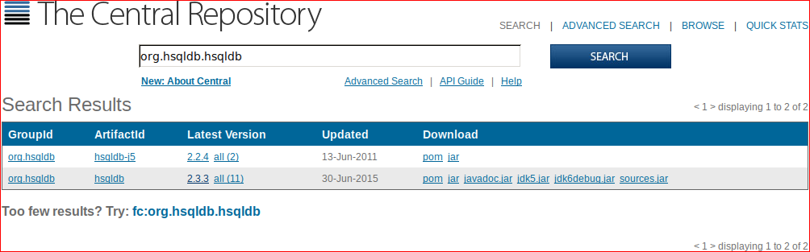

# JDBC database access in Scala with HSQLDB

## Dependencies

Find the desired version of `org.hsqldb:hsqldb` [Maven
Central](http://search.maven.org/#search|ga|1|org.hsqldb.hsqldb):



Looks like version `2.3.3` is the lastest.  Let's use it.

*build.sbt:*

```
libraryDependencies += "org.hsqldb" % "hsqldb" % "2.3.3"
```

## Setup

Instantiate the JDBC driver:

```scala
Class.forName("org.hsqldb.jdbcDriver")
```

Create a connection:

```scala
val c = java.sql.DriverManager.getConnection("jdbc:hsqldb:mem:mydb", "sa", "")
```

Create a table:

```scala
val s1 =
  c.prepareStatement(
    """|CREATE TABLE IF NOT EXISTS FOLKS (
       |  ID CHAR(36) NOT NULL,
       |  NAME VARCHAR(1024),
       |  PRIMARY KEY (ID)
       |)""".stripMargin
  )
s1.execute
s1.close
```

Insert a row:

```scala
val s2 =
  c.prepareStatement(
    """|INSERT INTO FOLKS (ID, NAME)
       |VALUES (?, ?)""".stripMargin
  )
s2.setString(1, "e9fcb4bd-c821-47c9-bc56-f997c361c1e2")
s2.setString(2, "Folky McFolkface")
s2.execute
s2.close
```

Query it:

```scala
val s3 = c.prepareStatement("SELECT ID, NAME FROM FOLKS WHERE ID = ?")
s3.setString(1, "e9fcb4bd-c821-47c9-bc56-f997c361c1e2")
val rs3 = s3.executeQuery
while (rs3.next()) {
  val id   = rs3.getString("ID")
  val name = rs3.getString("NAME")
  println(s"${id}: ${name}")
}
s3.close
```

## References

* [`java.sql` API](http://docs.oracle.com/javase/7/docs/api/java/sql/package-frame.html)
